# Data model mapper GUI

## Introduction

The Data model mapper GUI is a graphic user interface for the Data model mapper.
The Data model mapper functionalities are explained in [Data model mapper Readme](../Readme.md)

## Home

The section **Home** is where you can see all mapper records

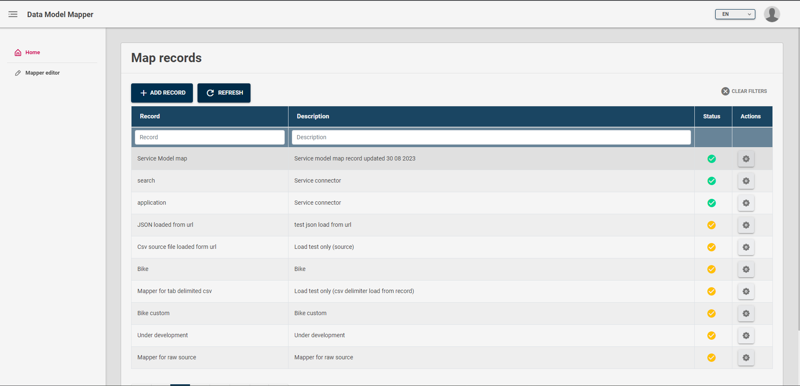

By clicking the button in the column **Actions** you can see a menu. If the status of the mapper record is *Under development* you can see three options: 

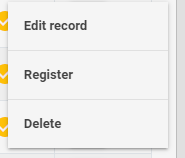

- *Edit mapper*. You'll be redirected in the mapper editor section and you can edit the record
- *Register*. You'll set the status of the mapper to *Completed*
- *Delete*. The mapper will be deleted.

 If the status of the mapper is *Completed* you can see two options:

  

- *Transform*. You can try the mapper with an input file
- *Deregister*. You'll change the status to *Under development*

If you click *Transform*, a dialog with two accordion will appear.

## Source

In the *Source* accordion, you'll see the csv input editor for sourceDataType csv

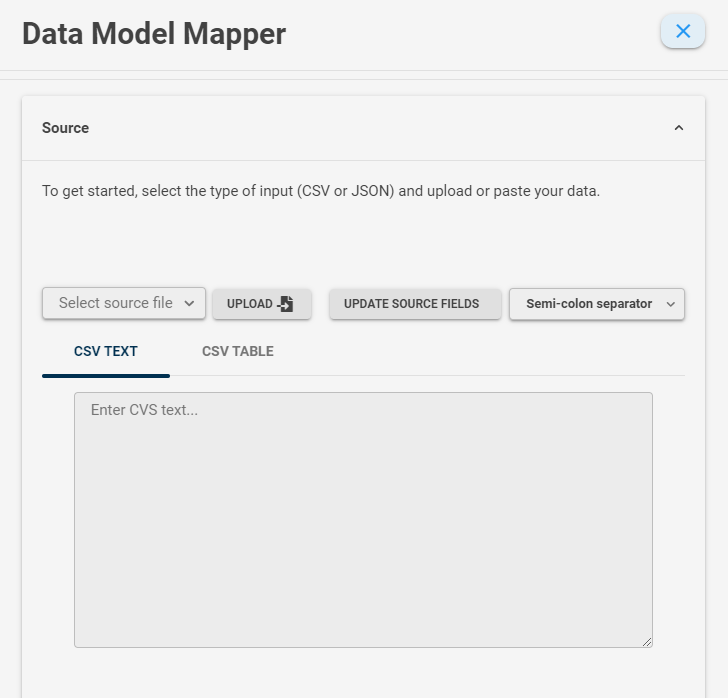

or the json input editor for sourceDataType json

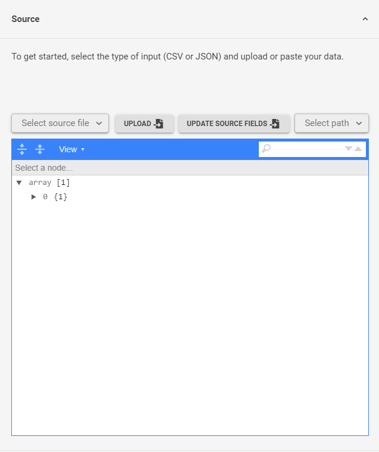

You can edit the source data in the same way explained in **Mapper editor section**.

## Output

In the *Output* accordion, you can transform your source input file by clicking *TRANFORM* button and download the transformed source by clicking the *DOWNLOAD* button.

If in your config.js file you have enabled the *mappingReport*, your last element of the array output will contain a report of your mapping, such as skipping files and object written to orion if enabled in *witers*

## Mapper editor

The section **Map editor** is where you can save or edit mapper settings.

It contains the following accordion 

-   *Source*. Where you can set the source input
-   *Mapper*. Where you can set the mapper options
-   *Output*. Where you can see a preview of the mapped source
-   *Config*. Where you can ser the transform config

## Source

In the **Source** accordion you can import a source file or edit it.

Firstly, select the input type source

For CSV input type, this it the source editor

You can either write your CSV data inside the textarea or import it by clicking the upload button.
If you want to import it, click **UPLOAD** button and a dialog will appear

By clicking on the select labeled **Select csv data** you can chose to import a source file from your PC 

or from a remote URL

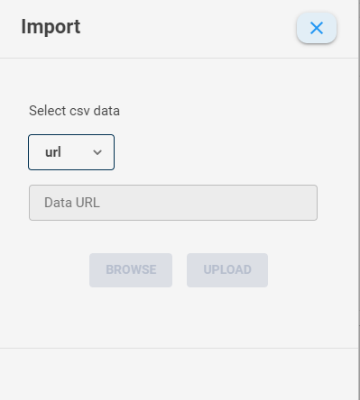

If you select **URL** paste or write the URL in the *Data URL* input and click **UPLOAD**.

If you chose **file** then you have to click **BROWSE** button and select your file from the explorer window

Click **open** and then click **UPLOAD**

You'll see the textarea filled with your source file

If you prefer a table view, click on **CSV TABLE**

If your table is not formatted properly, you must change the colon separator with the one present in your source file

Then you'll see the CSV formatted in a table view

If you want to import or edit a JSON file, click on the input type select and chose JSON

You'll see a JSON editor

You can write your JSON code by clicking on **View**

and selecting **Code**

If you want to import it, the steps are the same as mentioned for CSV import.

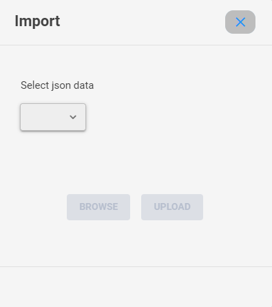

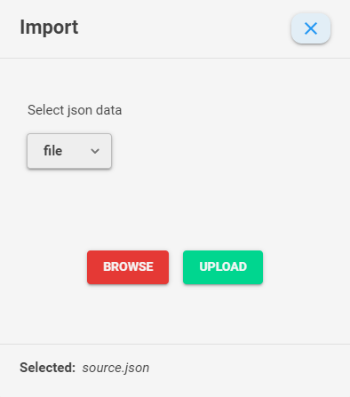

If you select **View** instead of **Code** you will see the JSON formatted differently

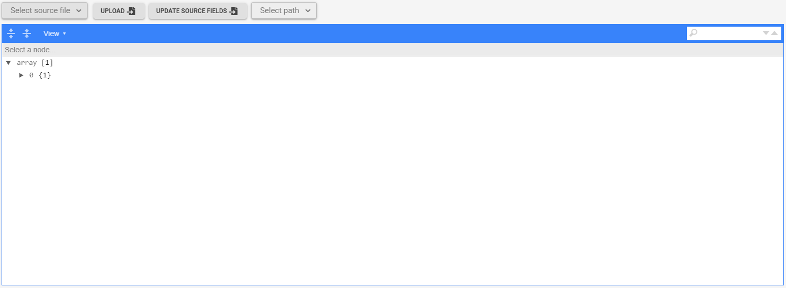

When you finished editing your source, click on **UPDATE SOURCE FIELDS** button and then click on **Select path** to select the path where you want to start analyzing your source field and subfields in order to map them. The value at selected path must be a json array.

## Mapper

In this section you can set the output schema

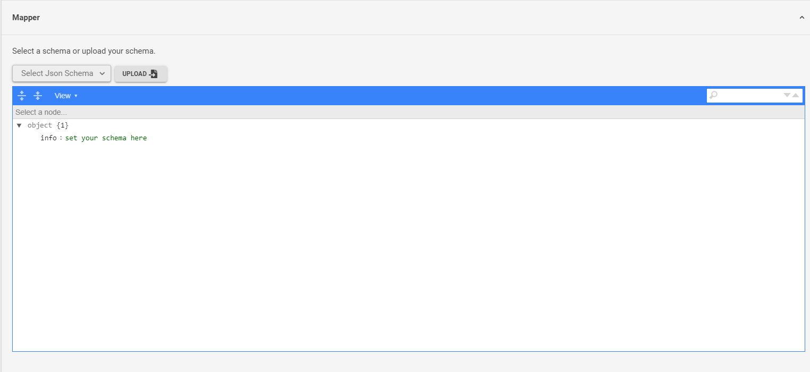

and the mapper settings

You can import a schema if you want set automatically the skeleton of the output. Click **UPLOAD** and the steps are the same as mentioned before for source imput. Same if you want to set it manually, just click **View** and then select **Code**

Once you finished writing or importing the schema, click on **GENERATE MAPPER** button (it will be showed once you start typing or once you imported the schema) to generate the mapper skeleton. 

If you prefer doing it manually, go down to the mapper editor

click **tree** and then **code**

this time, other 2 view features are available :

- *Tree*.  A tree like view, with a button near each field to easily map your subfield

- *Preview*.  A read only JSON map mapper preview

**Code** and **View** are the same as source editor.

If you imported the schema or you selected it from the select menu, you can start mapping your output subfield.

If you selected **Code** you can write manually the mapper settings as explained in [Data model mapper Readme](../Readme.md).

If you selected **Tree** mode, you can click next to the key subfield , on the **value** input field, and you can manually map the subfield there by texting it. 

or you can click the button near the mapping subfield if you want to be guided by a dialog UI.
First click it

then click Map

and a dialog will appear so you can easily select the map options from a select menu.

- Under *Select encode option* you can select the encode option (select *none* if you don't want to encode your output subfield)

- Under *Select single or multi output* you can chose if you want to concatenate some input subfield and / or static values into an array or an output string (depending on the schema destination type). Allowed values are **Single** or **Multi**

- Under *Direct or static input* you can chose to pick the output value from a source subfield or from a static value. Allowed values are **Direct** or **Static**

According to your choises : 

- If you chose **Single** and **Direct** you'll see an input menu where you can select the source input subfield to pick for the desired mapped output subfield 

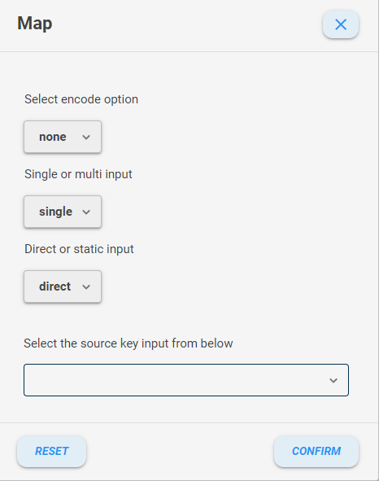

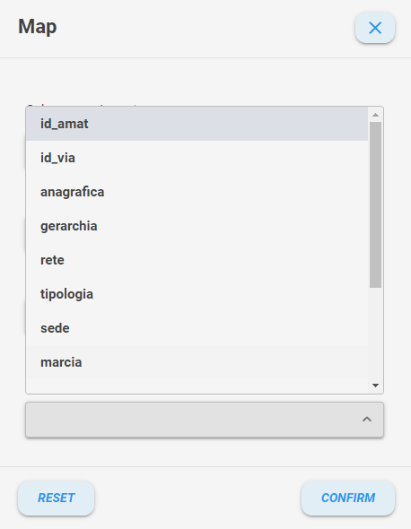

- If you chose **Single** and **Static** you'll see an input field where you can write a static value for the desired mapped output subfield 

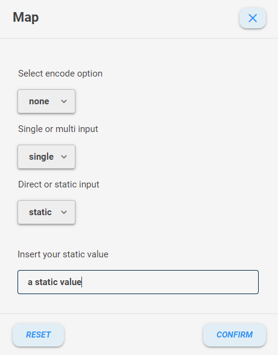

- If you chose **Multi** and **Direct** you'll see an input menu where you can select the source input subfield to pick for the desired mapped output subfield, an **Add Element** button to add it to an array / string (according to destination schema subfield type) and an ouput preview that will be filled each time you click **Add Element** button

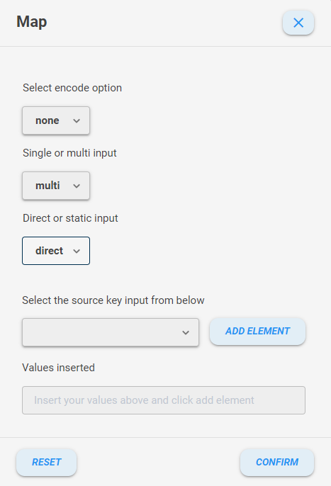

- If you chose **Multi** and **Static** you'll see an input field where you can write a static value for the desired mapped output subfield, an **Add Element** button to add it to an array / string (according to destination schema subfield type) and an ouput preview that will be filled each time you click **Add Element** button

Click **Confirm** to confirm your choices, **Reset** if you want to redo the mapping from the beginning (for the selected subfield).

You can also import a schema from Data model mapper DB by clicking **Select Json schema** and selecting the desired one

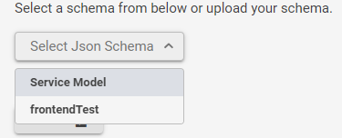

or import the entire mapper record by clicking **IMPORT** on the top of the page

or by selecting it from the Data model mapper DB 

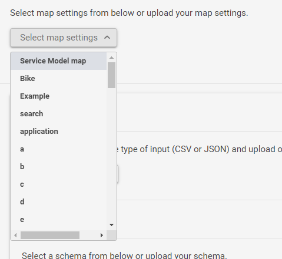

## Output

In this section you can see an ouptut preview (max 3 rows).

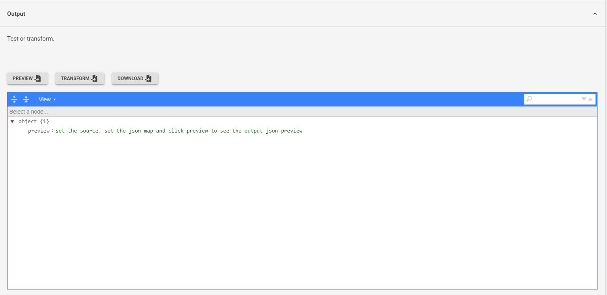

Click **PREVIEW** and you'll see the output preview in an JSON editor similar to the ones mentioned for the *Source* and *Mapper* accordion, but this time the available view options are **View** and **Preview**.

If in your config.js file you have enabled the *mappingReport*, your last element of the array output will contain a report of your mapping, such as skipping files and object written to orion if enabled in *witers*

## Saving

If the Output preview is good, you can save the map or export it.

If you want to change something, you can go back to the desired editor and modify the related text. If you want to reset all, click **CREATE NEW** button.

If you want to download mapper record, just click **EXPORT** button.

If you want to save mapper record into Data model mapper Database , click **SAVE AS NEW**.

A save dialog will appear.

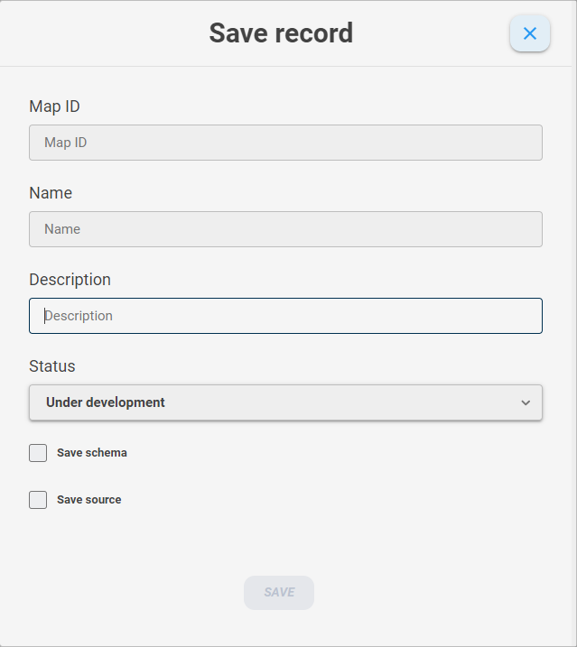

Chose a univoque Map ID and a name for the mapper record and then click save.

## Updating

If you want to update mapper record, click on **UPDATE**  button

and an update dialog will appear.

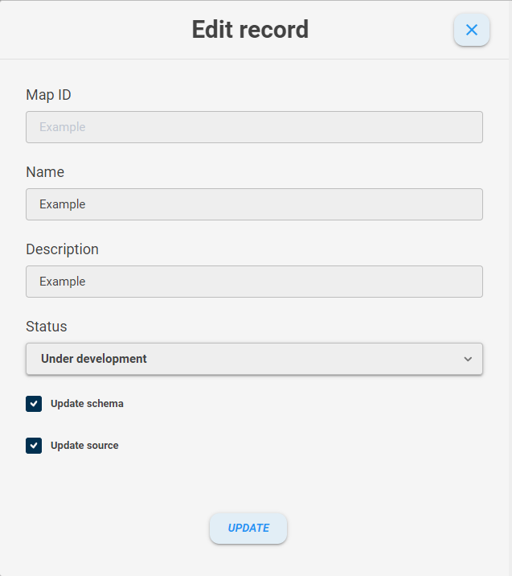

The Map ID is can't be touched, but you can edit the other fields. 
After finished, click **UPDATE** button.

## Server endpoint

If you want to use call the API endpoint with CURL, you can go to *Server endpoint* accordion and click the *UPDATE* button. You'll see the CURL snippet in a code view.

## Example payload

If you just need an example payload, you can go to *example payload* accordion and click the *UPDATE* button. You'll see the body example in a read-only json editor.

## Config accordion

The config settings can be modified by writing them on the [Config file](../backend/config.js) once you install the Data model mapper, however you can set your transform config template for each mapper record. Go down to the *Config* accordion and click it.

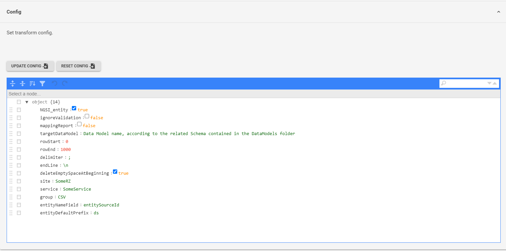

You can go to [README](../README.md) to read what each field mean. Once you finished modifying it, click on **UPDATE CONFIG** button or **RESER CONFIG** button if you want to revert all config fields to default.